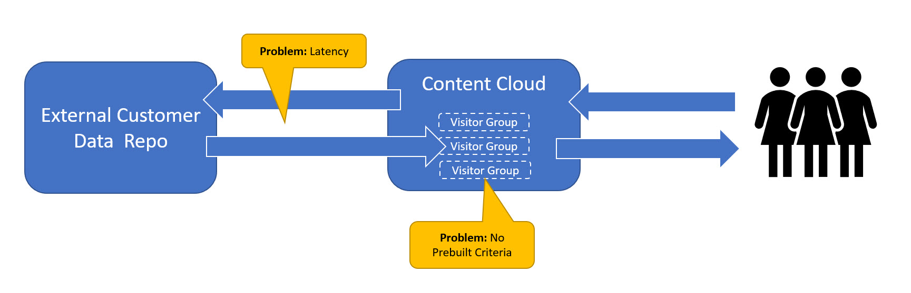
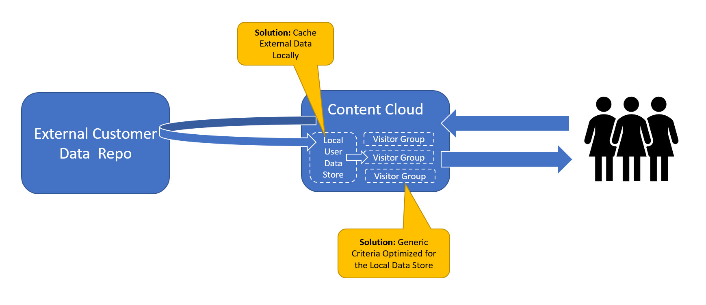
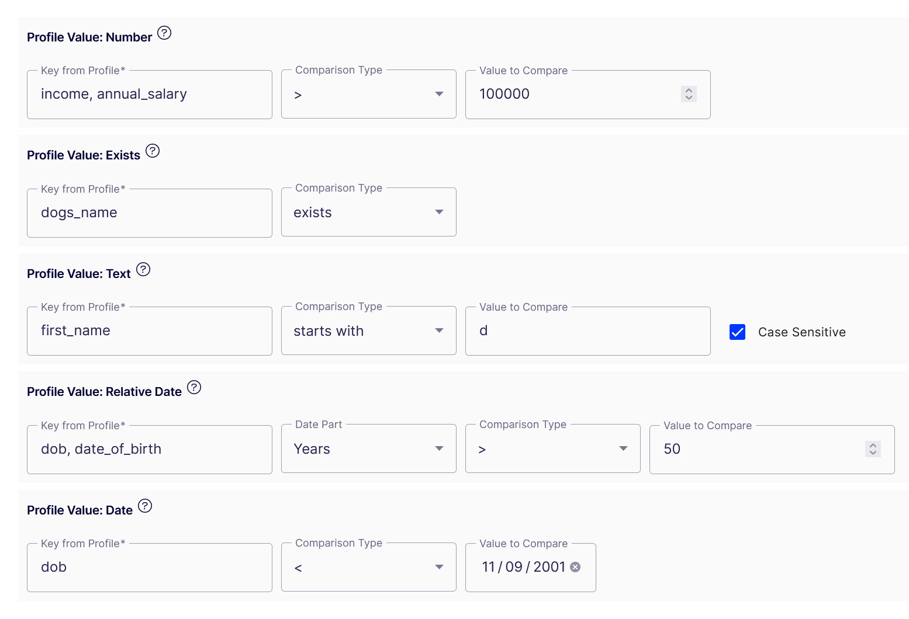
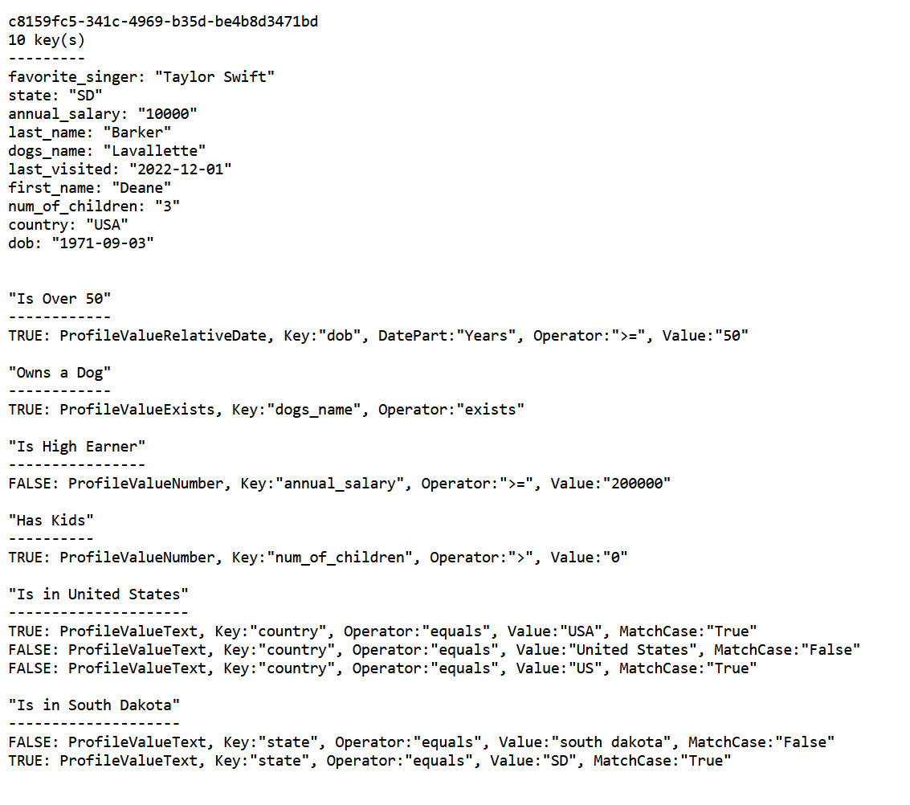

# Content Cloud Profile Visitor Groups

## Core Use Case

In general terms:

>You have some external store of profile information about your users -- an actual CDP or something else (a database table of employee information, for example). This is fairly static, non-volatile, demographic information that doesn't change based on immediate visitor behavior (examples: first name, email address, date-of-birth, etc.). You want to use this data to personalize content.

In more technical terms:

>You want to take this external data and bind it to the user's session in some queryable form. You don't want the overhead of querying the external data source every time, because the data doesn't change that often, so you just need it cached and available.
>
>Then you want a set of Visitor Group Criteria by which you can query this session store and show or hide content based on the results. This store of information can be anything, so you need the criteria to be generic and universally applicable.

(Note: if you're using the [Optimizely Data Platform](https://www.optimizely.com/data-platform/), you don't need this. Our built-in integration handles all this already.)

## Details

Here are the two problems we're trying to solve:

1. Latency of the repeated calls to the external data source (when the data most likely hasn't changed)
2. The lack of Visitor Group Criteria to query the external data source



The solutions for our two problems:

1. A one time call to the external data source, then coercion of that date into a known structure
2. A set of Visitor Group Criteria to query that known structure



### The Profile Data Store

This library allows a key/value store to be instantiated and (in the default implementation) bound to a cookie sent with the user's requests. This key-value store can be populated with data representing a user's demographic/profile information. This data population can happen at instantiation (the intention of the library), or dynamically, during the session (not really intended, but available).

The default key/value store is a `Dictionary<string,string>` (you can change this with your own service implementation -- XML and JSON samples are provided). All data is stored as a string, and converted for evaluation.

Henceforth, this data will be called "the profile."

These profiles are intended to be ephemeral. The use case is when they're populated by some external system -- like a CDP -- _on first request_, then just held in a session-like state for the duration of the visitor's session and used as a data source for Visitor Group logic so the external data source doesn't have to be repeatedly queried.

The default implementation just stores the profile data in cache. If you want to change this to persist profile data, you can inject a new service for `IProfileStore`. (But I don't recommend it. There are better ways of doing this -- this is why CDPs exist, remember.)

When the session ends, the profile will eventually be discarded from cache. It will be re-populated from the external store if a new session is created with the same cookie value.

### The Visitor Group Criteria

This library provides five different Visitor Group criteria to query information in this profile. For each, a key can be specified, and the value for this key will be retrieved from the profile to provide the basis for comparison.

The criteria and examples of a Visitor Group they might be used for.

* **Text:** compare if a text profile value equals, starts with, ends with, contains, (etc.) a provided number

  >For "Is VIP Prospect," determine if the value for `email_address` ends with "@potential-customer.com"

* **Number:** compare if a numeric profile value equals, is greater than, is less than, (etc.) a provided number

  >For "Has Children," determine if the value for `number_of_children` is greater than 0.

* **Date:** compare if a dated numeric profile value equals, is greater than, is less than, (etc.) a provider date 

  >For "Needs to Approve New TOC," determine if the value for `date_account_created` is prior to January 1, 2022.

* **Relative Date:** compare if a specified part of the timespan between a dated profile value and _now_ equals, is greater than, is less than, (etc.) a provided number

  >For "Is Adult," determine if the number of years between now and the value for `date_of_birth` is greater than 18.

* **Exists:** determine if a key does or does not exist (regardless of value)
  >For "Account is Suspended," determine if a key for `account_suspended_date` exists.

These criteria can be combined to define granular Visitor Groups based on profile information.



For all criteria, the "Profile Key" value can be comma-delimited. If so, keys will be checked in order, and the first one to return a value will be used. This is handy if a key name changes, or if the data is non-consistent.

>Specifying a key of `dob, date_of_birth` will look for a key named `dob` and use it if it exists, if not it will look for a key called `date_of_birth`.

## Adding Data to a Profile

The profile can be accessed via `ProfileManager`.

```
var profileManager = ServiceLocation.Current.GetInstance<IProfileManager>();
var profile = profileManager.LoadForCurrentUser();
```

If a profile doesn't exist for this visitor, it will be automatically created and bound to their request with a persistent cookie.

In most all cases, _this will happen automatically_ because any of the Visitor Group criteria described above will execute early in the pipeline, ask for the profile, and cause it to be instantiated and loaded with data.

The intention of the library is that you specify `ProfileLoaders` in configuration that will automatically execute when the data store is created, to populate it with data. These are `Func<Profile>` -- methods that take in the profile object and modify it.

```
ProfileManager.ProfileLoader(GetExternalData);

// Somewhere else in the codebase...
public static void GetExternalData(Profile profile)
{
  profile["some_key"] = "some value";
}

```

You can specify these loaders in `Startup.cs` (see below).

Alternately, you can add data to a profile manually, after it is created (the `Profile` object is simply a dictionary).

```
var profileManager = ServiceLocation.Current.GetInstance<IProfileManager>();
var profile = profileManager.LoadForCurrentUser();
profile["some_key"] = "some value";
profilerManager.Save(profile)
```

This should be thread-safe at the defaults. The `Profile` object is a `ConcurrentDictionary` and the default `IProfileStore` uses `MemoryCache`, both of which are  thread-safe. (If you inject something else for `IProfileStore`, then you need to consider potential concurrency issues.)

The ability to update the profile can be handy for a slow-running external store that you don't want to wait around for. You can _start_ the population process during profile instantiation, and when it finishes, it can update the profile. (Of course, this means you likely won't get to personalize the first request, but that's a tradeoff you might need to make, depending on how slow your data is.)

```
public static void LoadFromSlowDataSource(Profile profile)
{
  // Start the process and return to the calling code...
  Task.Run(() =>
  {
      // Lots of time passes...
      
      // ..finally
      var data = new Dictionary<string, string>
      {
        ["dogs_name"] = "Lavallette"
      };

      var profileManager = ServiceLocator.Current.GetInstance<IProfileManager>();

      // You pass in a dictionary of the data to be added
      // You don't pass the incoming profile, because it might have changed in the meantime
      profileManager.Update(profile.Id, data); 
  });
}
```

(Remember, using the default services, there's no way to _persist_ the profile. If you inject your own `IProfileStore` you could enable this, but that's not the intention of the library, really.)

## Installing

To enable:

```
services.AddProfileManager();
```

Or:

```
services.AddProfileVisitorGroups(options =>
{
  options.ProfileLoaders.Add((profile) =>
  {
    // (Clearly, you would do something a little more interesting for production...)
    profile["first_name"] = "Deane";
    profile["last_name"] = "Barker";
    profile["dob"] = "1971-09-03";
    profile["state"] = "SD";
    profile["country"] = "USA";
  });
});
```

You'll also need to register `IHttpContextAccessor`

```
services.AddSingleton<IHttpContextAccessor, HttpContextAccessor>();
```

Finally, you need to define a method to load the profile. If you don't, everything will appear to work fine, but the profile will never populate any data.

To do this, create an `Action<Profile>` and add it to the `ProfileLoaders` property on `ProfileManager` or in the options, as shown above. Inside the method, simply add key/value data to the dictionary. Remember, the default implementation is simply a dictionary of strings, so the normal key constraints apply.
  
```
// This is safe....
profile["first_name"] = "Deane"; // This will add the "first_name" key or update it, if it already exists
  
// This, not so much...
profile.Add("first_name", "Deane"); // If the "first_name" key was added by another loader, you'll get an error
```

The `SampleLoaders` class in the source provides some examples.


There are three injected services. They're established in `StartupExtensions.AddProfileManager`, but can be replaced anytime after that:

```
services.AddSingleton<IProfileManager, ProfileManager>();
services.AddSingleton<IProfileStore, ProfileStore>();
services.AddSingleton<IIDProvider, CookieIdProvider>();
services.AddSingleton<IProfile, Profile>();
```

## ID Providers

The default way of providing an ID to locate the profile data is to store it in a cookie, using the `ICookieIdProvider` service.

This is injectable. One other is provided: `IUsernameIdProvider` which will use the ID of the logged in user. (If no user is logged in, no profile will be found and all criteria will return `false`.)


## Testing Controller

`ProfileController` can be used to test the profiles.

* **/profile/show** will show the profile for the current user and how that profile is performing against all profile criteria in all visitor groups (see image below)
* **/profile/set** will allow manual setting of profile data via querystring: `/profile/set?key=first_name&value=deane`. Not supplying a value will cause that key to be deleted.
* **/profile/all** will show all profiles current in the system




## Status

Unofficial, unsupported, and largely untested. It was provided to a customer as a POC.
